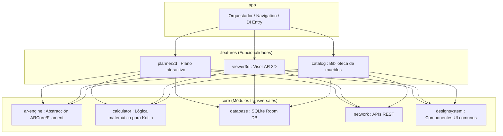

# 📐 DecoVista — Visualización y Planificación de Espacios 3D / AR

<div align="center">
  
  
  
  
  
</div>

---

**DecoVista** es una aplicación móvil nativa para Android escrita en Kotlin diseñada bajo principios de arquitectura modular premium. Permite a los usuarios diseñar planos en un lienzo digital interactivo 2D y proyectar modelos de muebles tridimensionales en su entorno real a escala métrica exacta 1:1 mediante Realidad Aumentada (AR).

> [!NOTE]
> La aplicación está diseñada con un aislamiento de dependencias riguroso que permite simular y probar la lógica espacial sin necesidad de inicializar el emulador de Android.

---

## 🚀 Características Principales

*   📐 **Plano Interactivo 2D**: Diseña y distribuye habitaciones en un Canvas interactivo y reactivo mapeado a escalas métricas de la vida real mediante gestos táctiles.
*   🕶️ **Proyección AR a Escala Real (1:1)**: Visualiza tus muebles 3D (formato `.glb` / `.gltf`) en tu casa a escala estricta $1\text{m} = 1\text{ unidad virtual}$ bloqueando el escalado accidental.
*   ⚡ **Detección de Colisiones OBB (Oriented Bounding Box)**: Motor geométrico en tiempo real basado en el *Teorema del Eje Separador (SAT)* para predecir si dos muebles rotados colisionan o si sobresalen del espacio útil de la habitación.
*   📂 **Catálogo de Muebles Local**: Persistencia rápida y reactiva en base de datos local SQLite mediante Room, con borrado relacional en cascada.

---

## 🛠️ Arquitectura Modular y Clean Architecture

DecoVista está estructurada con una arquitectura modular híbrida orientada a optimizar la velocidad de compilación, el aislamiento de dependencias nativas complejas y la testabilidad unitaria:



### Matriz de Módulos y Responsabilidades

| Módulo | Tipo | Responsabilidad Principal | Tecnologías Clave |
| :--- | :--- | :--- | :--- |
| `:app` | Android Application | Orquestación general, punto de entrada, manifest principal y flujos de navegación globales. | Compose Navigation |
| `:features:planner2d` | Android Library | Plano interactivo 2D, Canvas táctil en Compose, selección y transformaciones espaciales en metros. | Compose Canvas |
| `:features:viewer3d` | Android Library | Interfaz de Realidad Aumentada interactiva y control de cámara. | Compose |
| `:features:catalog` | Android Library | Lista y previsualización de muebles interactiva de la biblioteca. | Material Design 3 |
| `:core:calculator` | **Pure Kotlin (JVM)** | Motor geométrico. Algoritmo SAT (Separating Axis Theorem), cálculo de OBB y proximidad de colisiones sin SDK de Android. | Kotlin Standard Lib |
| `:core:database` | Android Library | Persistencia local persistente del catálogo y planos del usuario. | SQLite, Room Database |
| `:core:ar-engine` | Android Library | Abstracción de motores gráficos 3D/AR para desacoplar el visor de las APIs de bajo nivel de la GPU. | ARCore, Compose |
| `:core:designsystem` | Android Library | Paleta de colores premium (Slate/Blue/Zinc), tipografías personalizadas y componentes visuales reutilizables. | Jetpack Compose |

> [!IMPORTANT]
> **Aislamiento en `:core:calculator`**: Este módulo no tiene dependencias de `android.jar`, lo que permite correr las suites de pruebas unitarias matemáticas en microsegundos sin levantar emuladores ni depender de Robolectric.

---

## 📋 Requisitos del Sistema

*   **Android SDK**: API 26 (Android 8.0 Oreo) o superior.
*   **Hardware**: Dispositivo compatible con ARCore (Giroscopio, Acelerómetro y cámara con calibración AR) para el visor 3D.
*   **Herramientas**: Android Studio (Jellyfish o superior) y **JDK 17** (Temurin OpenJDK recomendado).

---

## ⚙️ Configuración y Ejecución

### 1. Clona el repositorio
```bash
git clone https://github.com/ashley-adaros/DecoVista.git
cd DecoVista
```

### 2. Compilar la aplicación Android
Para sincronizar, descargar dependencias y compilar el APK de depuración:
```bash
# En Windows (PowerShell/CMD):
.\gradlew.bat assembleDebug

# En Linux/macOS:
./gradlew assembleDebug
```

### 3. Ejecutar la simulación de consola (JVM pura)
Si deseas validar el comportamiento del motor geométrico, el cálculo OBB y el teorema SAT sin usar un emulador de Android:
```powershell
# Ejecutar el script automatizado en PowerShell:
.\run_simulation.ps1
```

> [!TIP]
> El simulador ejecutará de forma automática tres escenarios de prueba e imprimirá las métricas de ocupación, espacio y colisión en la consola.

---

## 🧪 Pruebas Unitarias

Para ejecutar el banco de pruebas completo del motor matemático de colisiones y verificar los límites de habitación:

```bash
# En Windows:
.\gradlew.bat :core:calculator:testUnitTest

# En Linux/macOS:
./gradlew :core:calculator:testUnitTest
```